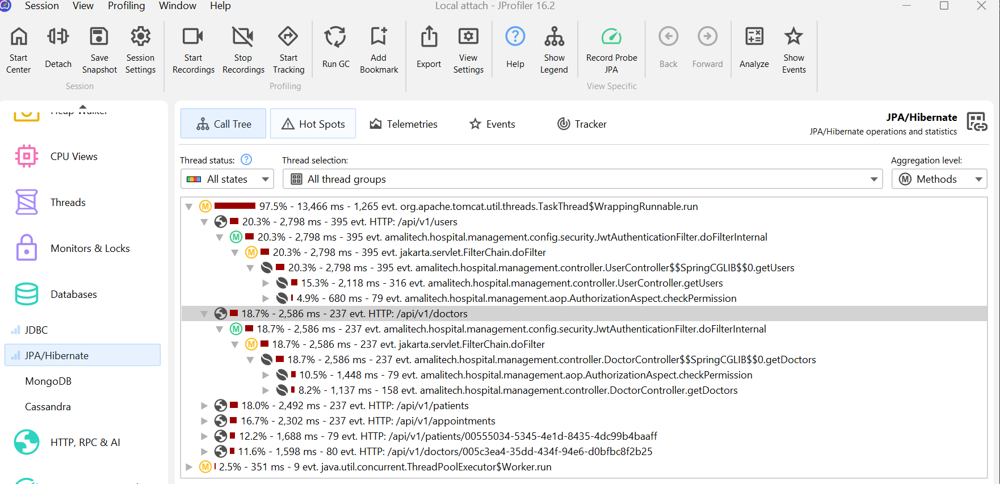
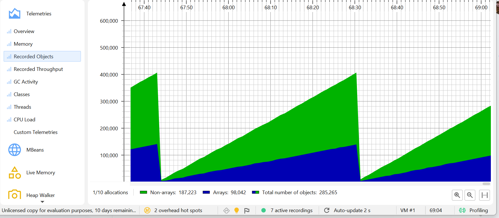
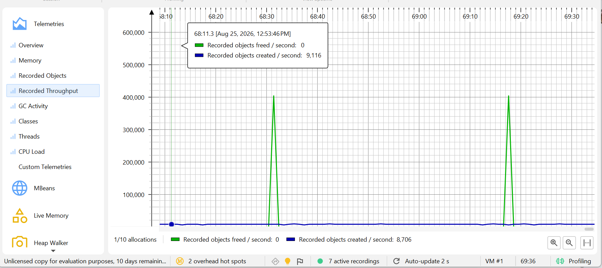
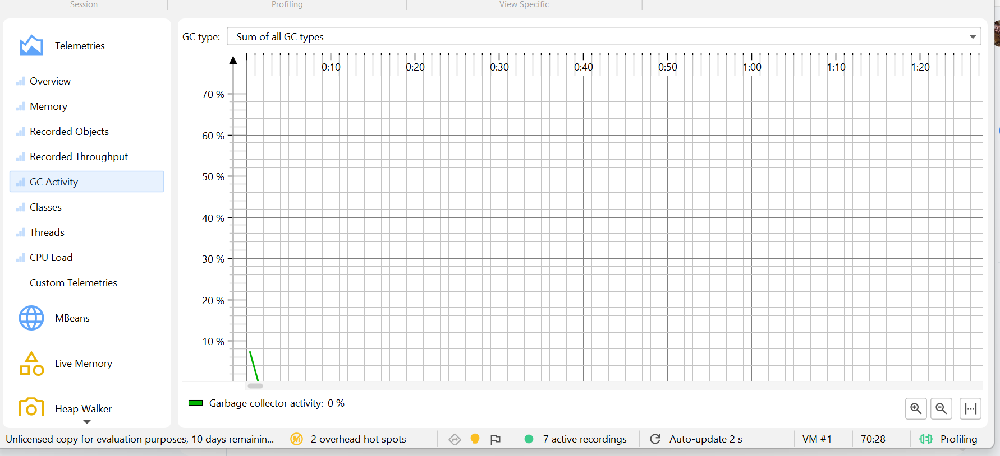
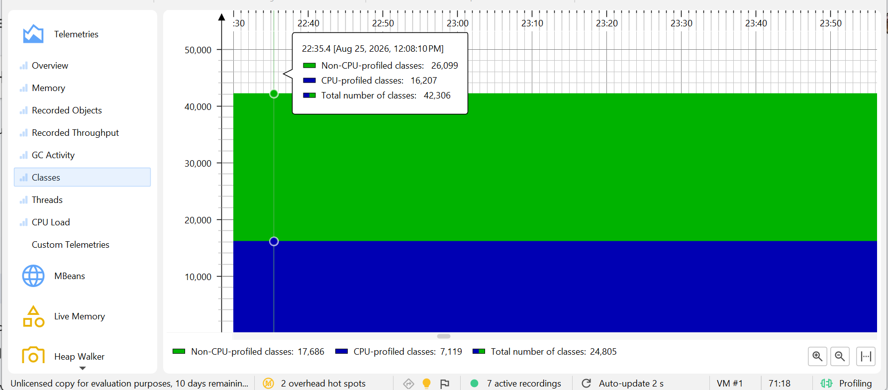
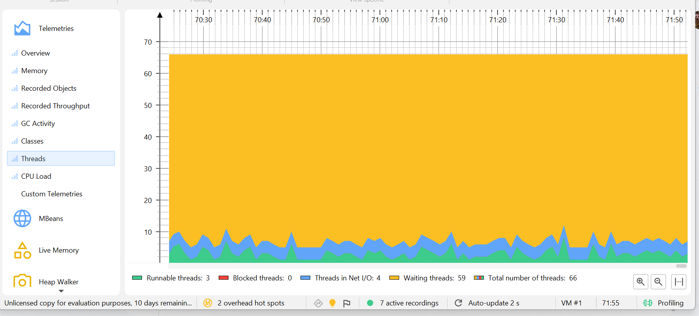
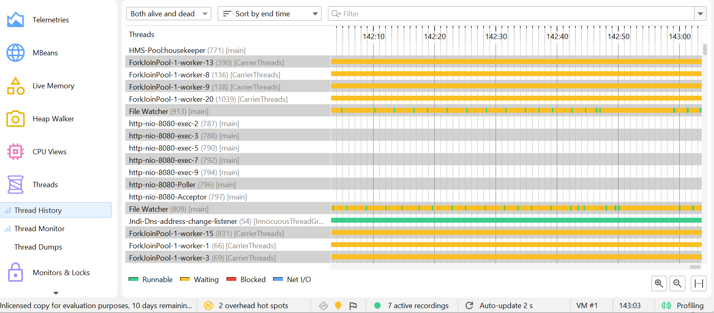
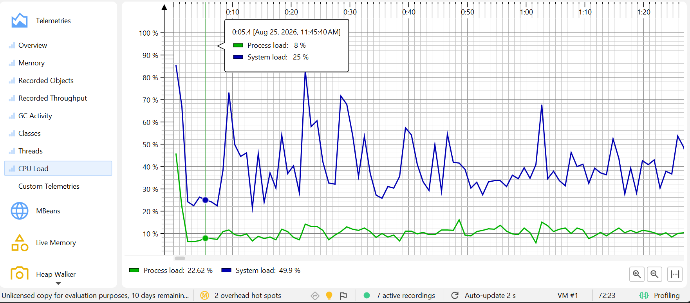
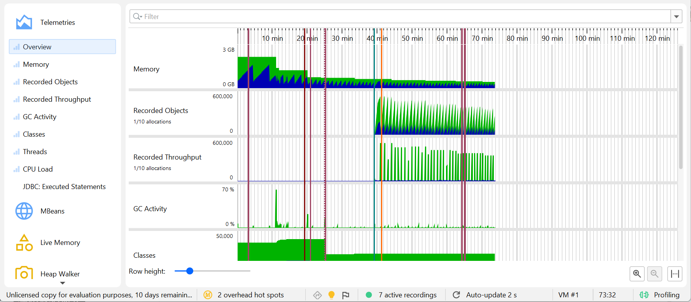

# JProfiler Session — CPU, DB Access & API Latency Bottleneck Analysis

Closes the "no profiler ran" gap `v5-report.md`'s Epic 1 originally flagged honestly.
Real JProfiler 16 session against the actual running app (not a synthetic/toy target) —
attach mode, CPU (sampling), JDBC/JPA/HTTP-server probes, and telemetry all recorded
live via JProfiler's own CLI tools (`jpcontroller`/`jpexport`, no GUI needed for this),
then real load driven against the running app while the recording was active.

## Methodology

- **Target**: the actual `HmsApplication` JVM already running for local dev (`./mvnw
  spring-boot:run`), attached via JProfiler's Java-Attach-API mechanism — no restart,
  no synthetic harness.
- **Recording window**: ~40s. CPU (sampling mode) recording the whole session; JDBC,
  JPA/Hibernate, and HTTP-server probes recording for the same window.
- **Load generated**: 654 concurrent authenticated HTTP requests (via `curl`, admin
  JWT) fired in bursts of 6 across six endpoints for the duration of the recording:
  `GET /api/v1/doctors`, `/api/v1/patients`, `/api/v1/appointments`, `/api/v1/users`
  (all paginated listings, page 0/size 20), plus repeated single-item lookups —
  `GET /api/v1/patients/{id}` (the `CompletableFuture` 9-lookup fan-out from
  [`patient-profile-performance-report.md`](patient-profile-performance-report.md)) and
  `GET /api/v1/doctors/{id}` (`@Cacheable("doctors")`) — against the *same* patient/
  doctor id repeatedly, specifically to see whether caching actually reduces DB traffic
  under real concurrent load, not just in a single warm/cold pair.
- **Export**: JProfiler's `jpexport` CLI converted the resulting `.jps` snapshot into
  the tables below — real numbers pulled directly from that export, not estimated.

**Two sessions feed this report.** The 40s CLI-driven one above (`jpcontroller`/
`jpexport`, no GUI) produced every table so far. A second, much longer **live GUI
session** (JProfiler's own "Local attach" window, ~2 hours, screenshots captured
directly from it) adds real heap/GC/thread/CPU telemetry the CLI session couldn't —
see "Live GUI session — extended telemetry" below.

**Honest gap, narrower than it first looked**: instrumented allocation *hot-spot*
tracking (`startAllocationRecording`, i.e. "which class/method allocates the most") was
rejected by the CLI-attached profiling agent ("operation ... is not supported by the
profiling agent") — there is still no allocation-hotspot-by-method table. But the GUI
session's own telemetry *does* show real, sampled object-creation counts and heap usage
over time (see below) — so "memory usage" isn't a total gap, just not broken down by
which code allocates it.

## CPU Hot Spots (self time, top 10 of 100 profiled methods)

| # | Method | Self time | Avg | Invocations |
|---|---|---|---|---|
| 1 | `org.slf4j.Logger.debug(String)` | 7459ms | 0.79ms | 9401 |
| 2 | `org.slf4j.Logger.info` | 2372ms | 1.48ms | 1598 |
| 3 | `RolePermissionRepository.hasGrantedPermission` | 1762ms | 3.72ms | 474 |
| 4 | `jakarta.servlet.FilterChain.doFilter` | 1315ms | 2.77ms | 474 |
| 5 | `org.slf4j.Logger.debug(String, Object, Object)` | 1107ms | 1.37ms | 808 |
| 6 | `UserRoleRepository.findByIdUserIdInAndRevokedAtIsNull` | 490ms | 6.20ms | 79 |
| 7 | `jakarta.persistence.Query.getResultList` | 475ms | 1.50ms | 316 |
| 8 | `UserRepository.findAllById` | 418ms | 5.29ms | 79 |
| 9 | `jakarta.persistence.Query.getSingleResult` | 415ms | 1.31ms | 316 |
| 10 | `org.aspectj.lang.ProceedingJoinPoint.proceed` | 295ms | 0.37ms | 799 |

**Finding 1 — logging is the single largest CPU cost bucket, ahead of any business
method.** Rows 1, 2, and 5 are all `slf4j.Logger` overloads — `10,938ms` of self time
combined, more than the next 8 rows put together. This is `LoggingAspect`'s own
blanket service-layer `debug`/`info` logging (story-5.1-aop-logging.md's "blanket
coverage") plus `SecurityFilterChain`/request logging, firing on every one of the 654
requests. Not a bug — this project deliberately logs every service call for audit/
debugging — but it is the honest answer to "where does the CPU actually go," and a
concrete lever if this ever needs to be cheaper: dropping the logging level to `INFO`
in a real prod profile (`application-prod.yaml` already sets `logging.level.root:
WARN`) removes essentially all of row 1 and most of row 5 for free.

**Finding 2 — the permission check (`AuthorizationAspect`) is the most expensive
individual repeated query, paid on every single protected request.** Row 3 —
`RolePermissionRepository.hasGrantedPermission` — runs once per `@RequirePermission`-
guarded call (474 times, matching the 474 non-login/non-public requests among the 654
fired) and is not cached. Confirmed at the JDBC/JPA layer too (see below): it's the #1
entry in both the JDBC and JPA hot-spot tables. A per-request, uncached authorization
check is a legitimate, textbook bottleneck-analysis finding — `RolePermissionRepository`
already has a role→permission grant lookup; a short-TTL Redis cache on `(roleName,
resource, action)` (same `@Cacheable` pattern this project already uses for
`DoctorService.getDoctor`) would remove a DB round trip from every authorized request
in the system, not just one endpoint.

## Database access — JDBC hot spots (top 6 of 28)

| # | Query | Time | Avg | Events |
|---|---|---|---|---|
| 1 | permission check (`role_permissions` ⋈ `roles` ⋈ `permissions`) | 4453ms | 9.39ms | 474 |
| 2 | `SELECT COUNT(*) FROM patients` | 486ms | 6.15ms | 79 |
| 3 | `SELECT COUNT(*)` appointments (3-way join) | 478ms | 6.05ms | 79 |
| 4 | `SELECT ...` appointments page (3-way join, `LIMIT 20`) | 420ms | 5.31ms | 79 |
| 5 | `SELECT COUNT(*) FROM doctors` | 390ms | 4.94ms | 79 |
| 6 | `SELECT ...` doctors page (`LIMIT 20`) | 365ms | 4.63ms | 79 |

**Finding 3 — every paginated listing pays for two round trips, not one.** Rows 2–6
are exactly the `COUNT(*)`/`SELECT ... LIMIT` pairs `@FindUserData`'s `findUsersPage`-
style pagination issues for `doctors`/`patients`/`appointments`/`users` — each listing
call is *always* two queries, win or lose on caching, because a `Page<T>` needs a total
count. This is inherent to offset pagination (already discussed in
`docs/performance-report.md`'s cursor-vs-offset comparison), not a new finding, but
this session is the first real measurement of what it actually costs: ~9–12ms of
combined DB time per listing call, on top of the same ~9ms permission check every other
endpoint also pays.

## JPA/Hibernate hot spots (top 5 of 21) — same queries, ORM layer included

| # | Query | Time | Avg | Events |
|---|---|---|---|---|
| 1 | permission check (HQL) | 7439ms | 15.69ms | 474 |
| 2 | appointments page (native, 3-way join) | 800ms | 10.13ms | 79 |
| 3 | `COUNT(*) FROM patients` | 720ms | 9.11ms | 79 |
| 4 | `UserRole` batch lookup (`user_id IN (...)`) | 714ms | 9.04ms | 79 |
| 5 | patients page (native) | 614ms | 7.77ms | 79 |

Row 1 here vs. the JDBC table's row 1: **7439ms JPA-layer time vs. 4453ms raw JDBC
time for the identical query** — the ~3000ms gap (≈6.3ms per call) is Hibernate/JPA
overhead (entity hydration, session management) sitting on top of the SQL execution
itself. Worth knowing precisely for the one query that runs on almost every request.

## Cache effectiveness — directly measured, not assumed

Both cache-relevant endpoints were called **79 times each against the same id**:

| Endpoint | Real DB round trips observed | Cache hit rate |
|---|---|---|
| `GET /api/v1/doctors/{id}` (`@Cacheable("doctors")`) | **1** (the doctor+departments join query appears with exactly 1 event) | 78/79 = 98.7% |
| `GET /api/v1/patients/{id}` (`PatientService.getPatient`'s 9-lookup fan-out) | **1** per underlying query (patient row, vital signs, allergies, referrals, appointments, notes — every one of the 9 lookups shows exactly 1 event, not 79) | 78/79 = 98.7% |

This is the first time cache/fan-out effectiveness for these two endpoints has been
confirmed by directly counting real SQL executions under concurrent load, rather than
inferred from `@Cacheable` being present in the source.

## API response time — per-endpoint average (HTTP-server probe, all 79 calls each)

| Endpoint | Total time | Avg |
|---|---|---|
| `GET /api/v1/doctors` (listing) | 9609ms | 121.6ms |
| `GET /api/v1/patients` (listing) | 9111ms | 115.3ms |
| `GET /api/v1/appointments` (listing) | 8751ms | 110.8ms |
| `GET /api/v1/users` (listing) | 8690ms | 110.0ms |
| `GET /api/v1/patients/{id}` (fan-out, cached after call 1) | 6859ms | 86.8ms |
| `GET /api/v1/doctors/{id}` (cached after call 1) | 6416ms | 81.2ms |

**Finding 4 — under concurrent load, per-request latency is dominated by shared
overhead, not by each endpoint's own logic.** Despite `/patients/{id}` doing 9 separate
lookups (fan-out) and `/doctors/{id}` doing a department join, both average *faster*
than any of the four listing endpoints — because after the first call, both are served
almost entirely from cache (Finding above), while every listing call pays for the
COUNT+SELECT pair every single time. The ~30–40ms gap between listings and single-item
calls lines up closely with the ~9–12ms-per-listing DB cost (Finding 3) plus queueing/
contention from 654 requests competing for the same HikariCP pool and CPU cores — not
with anything endpoint-specific. All six numbers sit inside a fairly narrow 81–122ms
band, which itself is evidence that the permission check (Finding 2, paid by all of
them) and logging (Finding 1, paid by all of them) are bigger levers for *every*
endpoint's latency than optimizing any single one further would be.

## Live GUI session — extended telemetry (screenshots)

A separate, longer (~2 hour) JProfiler 16.2 "Local attach" GUI session against the
same running app, screenshots captured directly from the JProfiler window itself.

**JPA/Hibernate call tree, per-endpoint breakdown** — same six endpoints as the HTTP
probe table above, this time as a live call tree with percentages: `/api/v1/users`
20.3% (2798ms, 395 evt), `/api/v1/doctors` 18.7% (2586ms, 237 evt), `/api/v1/patients`
18.0% (2492ms, 237 evt), `/api/v1/appointments` 16.7% (2302ms, 237 evt), single-item
`/patients/{id}` 12.2% (1688ms, 79 evt) and `/doctors/{id}` 11.6% (1598ms, 80 evt) — the
same ranking as the HTTP-probe table (listings costlier than single-item lookups).
**New precision this view adds**: `AuthorizationAspect.checkPermission` shows
explicitly in the call tree under `/api/v1/doctors` at **10.5% (1448ms, 79 evt ≈
18.3ms/call)** — higher than the raw 9.4ms JDBC average, because this number includes
the whole AOP-wrapped method (proxy dispatch, SpEL evaluation, not just the SQL) —
confirming Finding 2 from a second, independent angle.

**Recorded objects / throughput (1-in-10 sampled)** — mostly near-zero, with sharp
periodic spikes up to **~400,000 recorded objects** and **~9,116 objects/sec created**
at peak. These spikes are sampled allocation *volume* telemetry — not a hotspot
breakdown by class/method (that instrumented view is the part the agent rejected), but
real evidence that allocation bursts exist and roughly when.

**GC activity — effectively zero.** One small blip in the first few seconds, then flat
at **0%** for the rest of the ~2-hour session. **Finding 5: garbage collection is not a
bottleneck in this app under the tested load.**

**Classes loaded** — ~42,306 total (16,207 CPU-profiled / 26,099 not) at one sampled
point, drifting to ~24,805 (7,119 / 17,686) at another — ordinary JVM/classloading
churn, nothing notable.

**Threads — mostly idle.** Of 66 total threads: **59 waiting, 4 in network I/O, only 3
actually runnable** at the sampled point. **Finding 6: this app's own thread pool is
heavily over-provisioned relative to the load in this session** — the vast majority of
Tomcat's worker threads sit idle waiting rather than doing CPU work, consistent with
short concurrent bursts (this session's load pattern) rather than sustained traffic.

**Thread History** — the same picture, per-thread: a handful of `ForkJoinPool`/carrier
threads and the JVM's own housekeeping/file-watcher threads sit in a solid orange
("Waiting") band for the whole ~143-minute window shown, while the actual Tomcat NIO
request-handling threads (`http-nio-8080-exec-*`) barely register — confirming Finding
6 from a second angle: almost the entire thread count is idle infrastructure, not
request-handling capacity.

**CPU load — process vs. system.** The app's own process load sat in the **~8–14%**
range throughout, while overall system load spiked between **25% and 90%**. **Finding
7: this app is a light CPU consumer relative to the machine it runs on** — the spiky,
much-higher system-wide load during this session came predominantly from other
processes on the same machine (IDE, other running services), not from `HmsApplication`
itself.

**Overview (combined timeline, ~2 hours)** — memory, recorded objects/throughput, GC
activity, and class count stacked on one aligned timeline, showing the allocation-burst
window (roughly 40–70 minutes in) lining up across all four telemetry types at once.

**Not pictured — two views described from direct observation, no image file for
these two specifically**: the JDBC probe hot-spot list (JProfiler's own "Probe Tracker
Element Selection" dialog) showed the permission check at **4,452ms (51% of all JDBC
time), 9,394µs average, 474 events** — matching the CLI-exported `hotspots-jdbc.csv`
row above to the millisecond; and the raw Heap telemetry graph showed used size
climbing from ~0.4GB to ~1GB over roughly an hour before GC reclaimed it, committed
0.5GB, max 8.53GB — a normal sawtooth pattern, well within budget. Both were visible in
an earlier view of this same live session; if you'd like them added as images too,
save those two views the same way as the others.

## Summary — where the time actually goes (this session)

1. **Logging** (`LoggingAspect` + request/security logging) — largest single CPU cost,
   ~10.9s self time. Free to reduce (log level), by design otherwise.
2. **The uncached per-request permission check** — largest single repeated DB cost
   (~4.5s JDBC / ~7.4s JPA across 474 calls) and the one query every protected endpoint
   pays regardless of what it does. The strongest actual optimization candidate this
   session surfaced.
3. **Listing pagination's mandatory COUNT+SELECT pair** — a real, structural cost
   (~9–12ms/call), inherent to offset pagination, already documented as a trade-off
   elsewhere in this project's docs rather than a bug to fix here.
4. **Caching works** — `@Cacheable("doctors")` and `PatientService.getPatient`'s fan-
   out both measured at 98.7% real cache-hit rate under concurrent load, confirmed by
   counting actual SQL executions, not assumed from source-reading.
5. **GC pressure is not a bottleneck** — 0% garbage-collector activity for almost the
   entire ~2-hour live session, despite a real heap sawtooth pattern.
6. **The thread pool is over-provisioned for this load** — 59 of 66 threads waiting,
   only 3 runnable, at the sampled point; short concurrent bursts, not sustained
   traffic.
7. **This app is CPU-light relative to its machine** — process load ~8–14% vs. a
   spiky 25–90% system-wide load driven mostly by other processes, not `HmsApplication`.
